<h1 align="center">
  
</h1>

<h1>Hello World!</h1>

Welcome to my page!     This is Daniyal Kukda , currently working as a Software Engineer at Nisum. I am a Full Stack developer with more than 3 years of experience in design, development, and support for web/mobile enterprise applications.

<h3>Technologies and Tools I code with</h3>

  
  
  
  
  
  
  
   
  
  
  
  
  
  
  
  
  
  
  
  
  
  
  
  
  
  
  
  
  
  
  
  
  
  
  
  
  
  
  
  
  
  
  

<h2>⚡️ A Few Quick Facts</h2>
<ul>
<li>🔭 I’m currently working for <a href="https://www.nisum.com/">Nisum</a>.</li>
<li>👨‍💻 I’m currently working on an ecommerce project that uses MERN Stack with AWS Lambda</li>
<li>🧐 Learning about <strong>Serverless Architectures</strong>, <strong>distributed systems</strong>, and a bit of <strong>Blockchain</strong>.</li>
<li>👨‍💻 Most of my projects are available on <a href="https://github.com/DaniyalKukda">Github</a>.</li>
<li>💬 Ping me about <strong>JavaScript, React, Node, and Serverless stuff</strong>.</li>
</ul>

<h3>Where to find me</h3>

   
   
  
  

<!--
**DaniyalKukda/DaniyalKukda** is a ✨ _special_ ✨ repository because its `README.md` (this file) appears on your GitHub profile.

Here are some ideas to get you started:

- 🔭 I’m currently working on ...
- 🌱 I’m currently learning ...
- 👯 I’m looking to collaborate on ...
- 🤔 I’m looking for help with ...
- 💬 Ask me about ...
- 📫 How to reach me: ...
- 😄 Pronouns: ...
- ⚡ Fun fact: ...
-->
